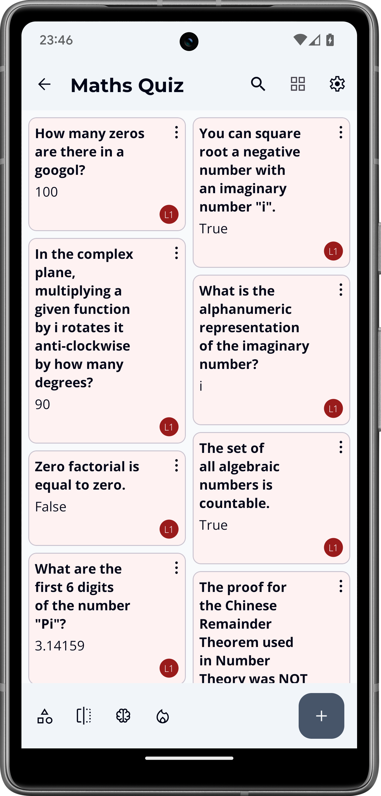
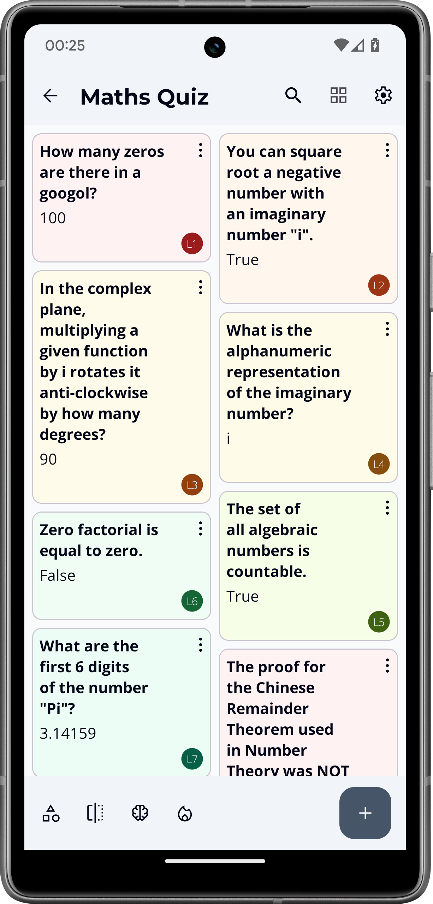
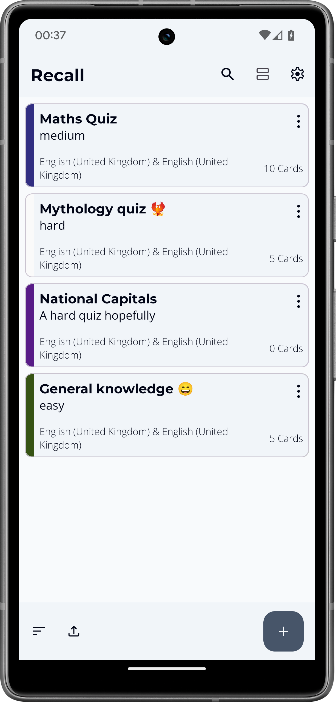
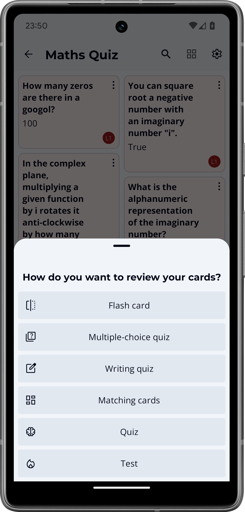
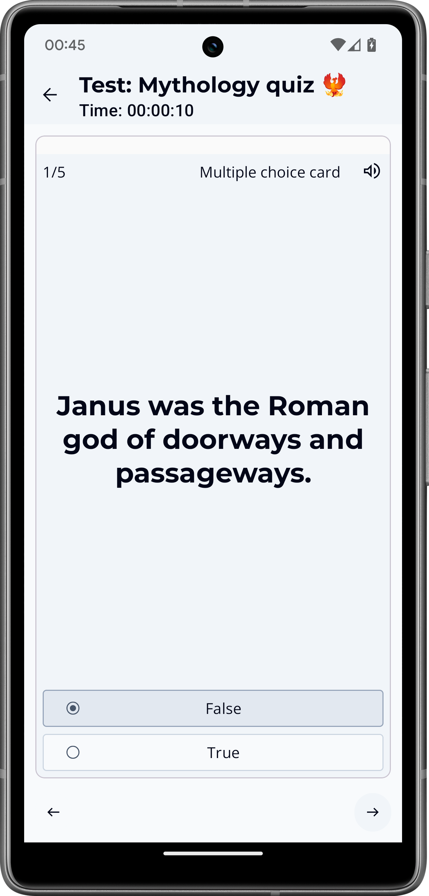
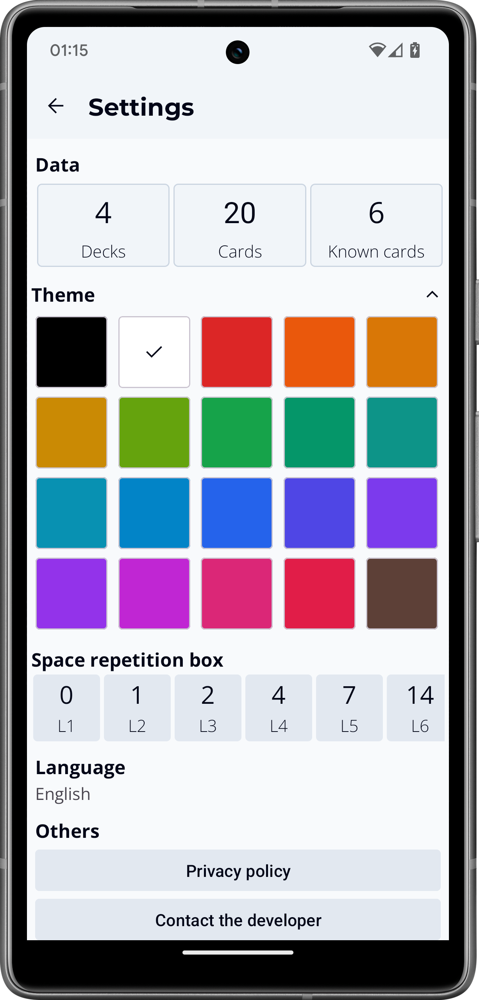
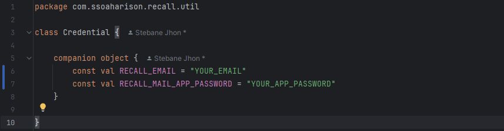

# Recall 
**`An open-source Quiz & Flashcard app`**

## Tech stack 
- Kotlin: Programming language
- XML: UI Library
- Retrofit: API library used to upload data from “Open trivia database”
- Room DB: For storing data on device
- SMTP: For mail sending
- Firebase: For text translation api

## Instructions
If you are to build your own variation of this app, please consider this:
- In “app/src/main/java/com/ssoaharison/recall/util”, add a new file “Credential.kt” with the following content:
     This is for the mail sending function of the app.

## Background
This app started as a simple Flash Card app meant to be a tool to take quick question/answer notes to assist in exam preparation. It developed quickly into a general quiz creation app and handles a large range of question types and various manners of revising them. 
 
This is a project that has been in my mind since I started programming and I tempted developing it as my final project for the app development course I took at Lerums Vuxenutbildning when I was part of the LineroTech program. 
My final project was a functional application that I was proud of but it was just a glimpse of the app that I had in mind.

I kept on developing the application with the ambition to put it in my CV and to show my mastery of Android development. 

Now, I think! it is ready to be shown to the world. I still consider it as a minimum viable product. I spent lots of time developing it. I will keep on updating it in the future and keep on adding new functionalities. Here is what it is for now…

## Intro 
The point of this application is to create Quizzes and to review them through various minigames. 

There are multiple types of questions you can add to your Quiz to give it more variety. 

The app provides plenty of minigames to help you interact with your questions and review them in different manners to vary the way you trigger your memory and challenge your knowledge.
